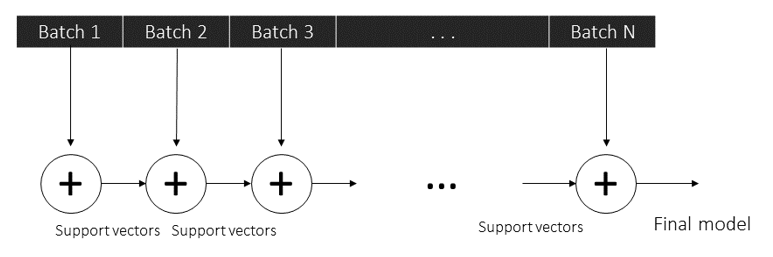
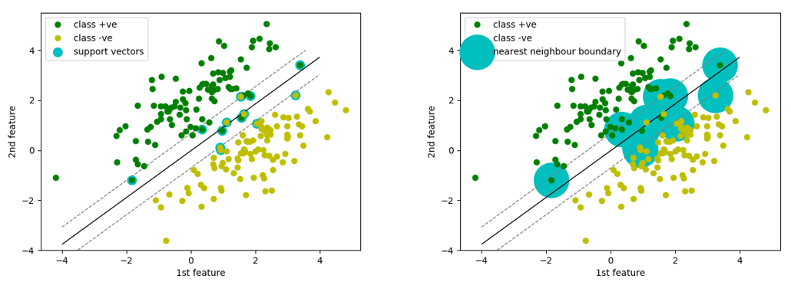
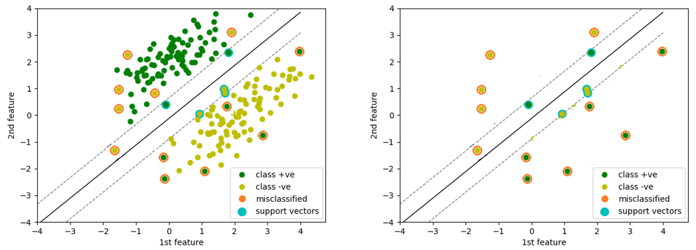
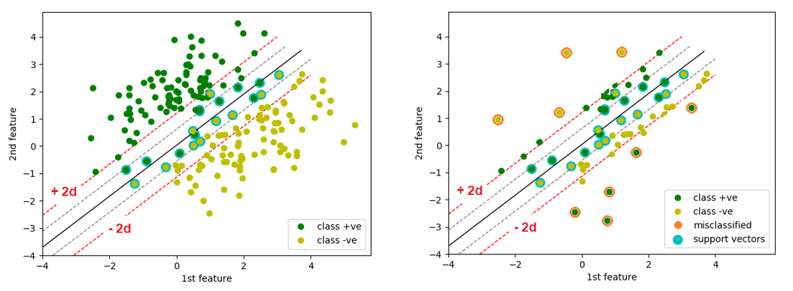
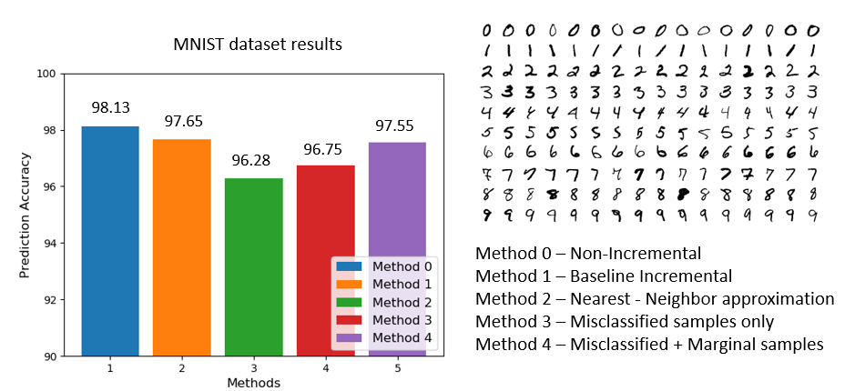
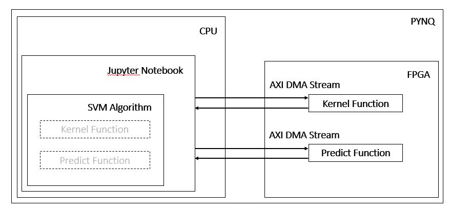
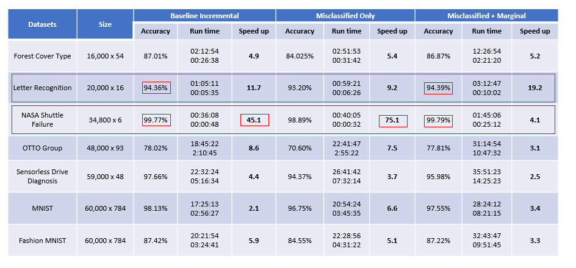
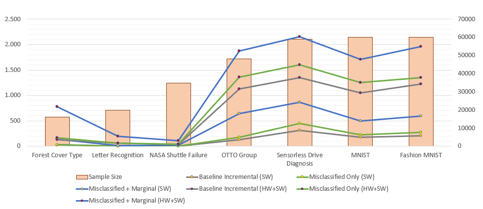

# Accelerated Incremental Learning with Support vector Machines

This Thesis aims to investigate the possibility of implementing the SVM algorithm on an embedded SoC
with changes to the algorithm structure to accommodate learning from large volumes of data in an
incremental manner with approximations to the computations. The finalized software-only approximated
incremental algorithm achieved an accuracy difference of 0.63% (reduction) when compared to the base
non-incremental algorithm and a difference of and 1.2% (reduction) when compared to a state of the art
implementation of the SVM classifer. A speed up of nearly 4.0 (improvement) was achieved as a result
of accelerating the training and inference phases of the classifier, validating the possibility of deploying
approximated incremental ML algorithms to reconfigurable embedded devices.

## Support Vector Forwarding

The most trivial form of Incremental learning widely used is dividing our dataset into a number of batches, and lets say that we train on our first batch, obtain a asset of support vectors from the present batch. We then proceed to forward these support vectors only and append them to the next batch of incoming data and subject this new batch of data to training. This way support vectors from every batch keep getting forwarded through out bathes unless a better set of support vectors replace a previous one. 

## Approximations

### Input Approximation by K-Nearest Neighbours Clustering

The points closest to the hyperplane and the margins are capable of altering an established decision
boundary during to the training phase. Hence it is intuitive to find out which points in an incoming
training batch lie close to the already established boundary and to subject these points to further training
instead of having to go through all the training samples. The K-Nearest Neighbours method, as the name
suggests looks at k neighbours that lie nearest to a chosen point. The idea is that we extract the support
vectors with the first batch of training samples that come in, and for the successive training batches we
sub sample only the points that lie within a radius of x units as the neighbours.

### Input Approximation using Misclassified Samples

This approach involved dealing only with samples that we are unable to classify correctly. If the model is
able to classify current samples correctly using the support vectors and lagrange multipliers generated
from the previous batch, then these samples need not be retrained. We instead focus on samples that the
algorithm has misclassified.

### Input Approximation using Misclassified and Marginal Points

This algorithm is an extension of the above algorithm. Instead of only considering the misclassified points, we
also consider points that lie in a region of width 2 the margin from the decision boundary. This is
backed by the fact that was established that points that lie close to the hyperplane and the margin are
capable of altering the decision boundary and hence are interesting to be subjected to training.

## Prediction Results

The Non incremental algorithm had a prediction accuracy of 98% whereas our baseline incremental came close at 97.65%. The Baseline incremental classification accuracy is what we are aiming to reach and it is clear that the final method of misclassified + marginal points comes very close at 97.55%.

It is not possible to run the non incremental since the board immediately runs out of memory

## Hardware Acceleration
 
### Architecture

The functions from the software implementation that were chosen to be accelerated in the FPGA are the
Kernel Matrix Computation function and the Prediction function which were found to be the two most
computationally intensive functions. The effects of having large number of samples and the complexity of
the kernel computations on them are discussed in chapter 2.18. Since our algorithm involves a prediction
phase inside the training phase as noticeable in algorithm 7, the Predict function was also considered to
be accelerated.

### Acceleration Results

The following table represents the results of our hardware acceleration for various commonly used datasets in the machine learning community. We represent the number of samples considered and compare results for our three Incremental methods. The run time on the top indicates the CPU only time and the one on the bottom indicated the Hardware accelerated. In all cases we can see that the prediction accuracy values of our final algorithm are very close to the baseline incremental implementation. Some points of interest are that in this particular dataset, we achieved very high acceleration speed up about 45 to 75 times. And along with this the other dataset we can observe that our final algorithm actually surpassed the accuracy of the baseline incremental.

## Hardware/Software Runtime

## Speed up

There is an unstated rule saying that if the number of features lie withing the degree of the polynomial that is used in the kernel trick, the SVM performs very fast and its computation time increases non linearly with an increase in the number of features above this limit. This is due to the limitation of the number of samples that the FPGA can process at a time. The accelerator is implemented to tile and batch process the samples as well as the support vectors it needs in order to perform prediction and kernel computation and hence there is a drop in the speed up for datasets with a larger number of features.

### Conclusion

